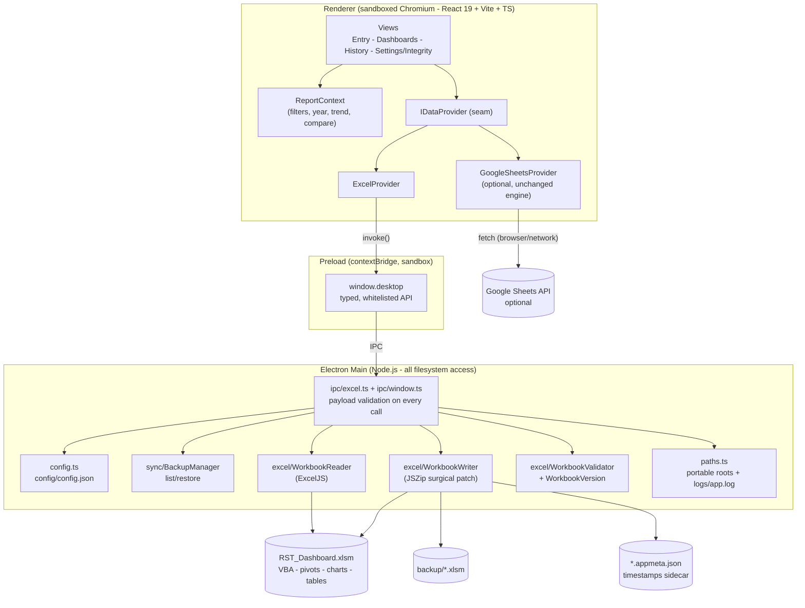

# Architecture — Energy Monitor Desktop

## 1. System architecture



**Security posture**: `contextIsolation: true`, `nodeIntegration: false`,
`sandbox: true`, no remote module, navigation and popups locked down, every
IPC payload re-validated in the main process (paths must be absolute
`.xlsm/.xlsx`; logs re-checked field-by-field before touching disk).

## 2. IPC design

All channels are `ipcRenderer.invoke` (request/response) and resolve to
`{ ok: true, ...payload }` or `{ ok: false, code, message }` — never thrown
strings. One push channel (`open-file-path`) delivers Open-With requests.

| Channel | Direction | Purpose |
|---|---|---|
| `excel:open` | R→M | Open workbook (native picker when path is null) → logs + validation + integrity + health + lock |
| `excel:reload` | R→M | Re-read the current workbook from disk |
| `excel:save` | R→M | Validate payload → patch → verify → backup → atomic replace |
| `excel:saveAs` | R→M | Native save dialog + same pipeline to a new path |
| `excel:checkLock` | R→M | Excel lock / `~$` owner-file detection |
| `excel:validate` | R→M | Standalone health + integrity report |
| `backup:list` / `backup:restore` | R→M | Timestamped backups; validated, safety-backed-up restore |
| `recovery:get/set/clear` | R→M | Crash-recovery journal (config/recovery.json) |
| `export:file` | R→M | JSON/CSV export via native save dialog (defaults to exports/) |
| `config:get/update/reset`, `recent:clear` | R→M | Portable config (whitelist-sanitized patches) |
| `app:info` | R→M | Version, app root, portable flag, bundled-workbook path |
| `shell:showItemInFolder` | R→M | Reveal a file in Explorer |
| `open-file-path` | M→R | File association / second-instance / CLI argument |

## 3. Data flow

### Read (open / reload / validate)

```
RST_Dashboard.xlsm
  → ExcelJS parse (WorkbookReader)
  → sheet resolution by keywords (ExcelSchema: "1. UPS Data Log", ...)
  → header-row detection ("Month") + column resolution per sheet
  → rows → MonthlyLog[] (SheetMapper: serial dates → YYYY-MM,
    device matching "UPS 15A (PPC44A)" ≡ "UPS 15A")
  → + sidecar timestamps (WorkbookVersion, *.appmeta.json)
  → + validation errors/warnings + integrity report (WorkbookValidator)
  → IPC → ExcelProvider → App state:
      logs (entry views) & syncedLogs (all report views)
```

### Write (save / save-as / auto-save)

```
UI Save → in-memory store updated → provider.saveAll(all logs)
  → IPC payload validation (shape, months, value domains)
  → JSZip opens the original workbook          (WorkbookWriter)
      - regenerate ONLY <sheetData> of the 4 log sheets
      - carry unmanaged columns by row identity (e.g. 4th-floor cost)
      - re-emit calculated columns as formulas (no stale cache)
      - extend Excel Table + autofilter ranges
      - drop calcChain, set fullCalcOnLoad, pivot refreshOnLoad
      - everything else byte-identical (vbaProject.bin, charts, pivots)
  → re-read patched buffer, compare round-trip  (abort if mismatch)
  → timestamped backup of the current file      (backup/, rotated)
  → temp file + atomic rename
  → sidecar timestamps written
  → renderer re-reads from disk → UI state = file truth
```

### Failure path

```
save fails (LOCKED/…) → edits stay in memory → recovery journal written
  → Retry / Save As / Cancel dialog (or silent toast for auto-save)
  → next launch: "Restore & Save / Discard" if the journal matches
```

## 4. Why the writer patches at zip level (not ExcelJS write)

`RST_Dashboard.xlsm` is a live Excel application: `vbaProject.bin`, a pivot
table + cache, two charts, drawings, Excel Tables with structured-reference
calculated columns, comments and control properties. ExcelJS's writer
serializes only what its model understands — writing with it would strip the
macros and dashboard. The writer therefore treats the workbook as an OPC/zip
package and rewrites only the parts the app owns. ExcelJS is still used for
all reading and for post-patch validation.

## 5. Portable storage model

| Data | Location |
|---|---|
| Business data | The workbook (`.xlsm`) — nowhere else |
| Timestamps ("last saved") | `<workbook>.appmeta.json` sidecar |
| Configuration | `config/config.json` beside the exe |
| Crash journal | `config/recovery.json` |
| Backups | `backup/` (or configured folder) |
| Logs | `logs/app.log` (size-rotated) |
| Exports | `exports/` |

`PORTABLE_EXECUTABLE_DIR` (set by the electron-builder portable stub) roots
all of these beside the double-clicked exe; unpacked builds use the exe's
directory; development uses the project root. Browser Local Storage holds
only per-machine view preferences (report filters) in the desktop build.

## 6. Known technical debt

Dashboard UPS topology (groups, UMDB/STS/OUDB mapping) is config-driven
via `facility.profile.dashboard` (`config/<id>/profile.json`) — no
facility-identity branching remains in `DashboardSummary.tsx` /
`UniversalFilterBar.tsx`. Srinakarin's device-ID list is currently
duplicated across that JSON config and `SRINAKARIN_AGGREGATE_IDS`
(`src/utils/srinakarinPower.ts`) because JSON cannot reference a
TypeScript constant — a maintainability concern only, not a correctness
or production issue. Full detail, plus a second, unrelated item
(`test:excel` targeting the retired `RST_Dashboard.xlsm`), in
`KNOWN_TECHNICAL_DEBT.md`. Planned resolutions in `ROADMAP.md`.
