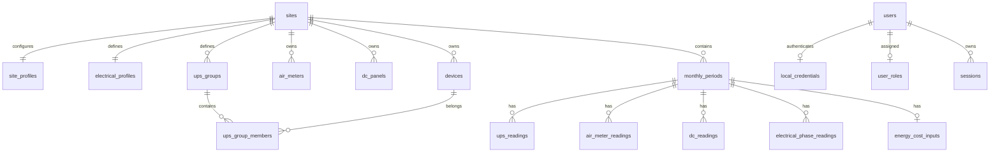

# Energy Monitor Web Clean v1 — Data Model

## Principles

- Supabase PostgreSQL remains the system of record.
- Existing tables and data are retained; clean v1 does not recreate or
  migrate the dataset.
- Raw monthly readings are authoritative. Dashboard, history, CSV, Excel, and
  PDF values are derived from them with the Desktop v2.3.1 formula contract.
- Every table remains protected by RLS and the server applies facility and
  permission scope before querying.
- A monthly save is transactional and uses `monthly_periods.row_version` for
  optimistic concurrency.

## Existing core entities

### Configuration and master data

| Table | Clean v1 use |
|---|---|
| `sites` | Facility identity (`code`, `name`, `active`). |
| `site_profiles` | Facility profile/version and JSON policy metadata. |
| `electrical_profiles` | Desktop formula mapping: UPS groups, DC IDs, Air fields, special rules. |
| `devices` | UPS/PPC device codes and facility ownership. |
| `air_meters` | Air meter codes and labels/metadata. |
| `dc_panels` | DC panel codes and metadata. |
| `ups_groups` / `ups_group_members` | Dashboard grouping and capacity. Composite facility foreign keys prevent cross-site references. |

### Monthly operational data

| Table | Desktop mapping |
|---|---|
| `monthly_periods` | One `site_id + period_month`, row version, timestamps, and per-section save timestamps where present. |
| `ups_readings` | One device/phase row: voltage, current, load kW/kVA, raw input JSON. |
| `air_meter_readings` | One meter reading per period. `eb41a` etc. map to meter code. |
| `dc_readings` | One panel row: voltage/current. |
| `electrical_phase_readings` | Srinakarin raw phase/PPC inputs without collapsing source rows. |
| `energy_cost_inputs` | One period row: building energy kWh and building cost THB. |
| `audit_events` | Actor, action, entity, before/after metadata, and correlation ID for writes/admin actions. |

Derived values such as floor energy, floor cost, rate, share, PUE, health, and
chart series are calculated from these rows. `legacy_cached_evidence` and
`calculation_*` tables are not needed for the clean v1 request path.

### Authentication and authorization

| Table | Purpose |
|---|---|
| `users` | Username, display name, active/lock state, version and timestamps. |
| `local_credentials` | Argon2id password hash and password version; never a plaintext password. |
| `roles` | Fixed `admin` and `user` roles. |
| `user_roles` | One effective role per user. |
| `sessions` | Hashed session token, expiry, revocation and request metadata. |
| `http_rate_limit_buckets` | Durable login/request throttling state. |

## Save contract

`PUT /api/clean/v1/sites/:siteId/periods/:month` accepts one validated
`MonthlyLog` plus `expected_row_version`.

The server transaction:

1. verifies the active site, canonical month, user permission, and row version;
2. upserts `monthly_periods`;
3. upserts the configured UPS rows and Srinakarin phase rows;
4. upserts Air meter rows and DC panel rows;
5. upserts `energy_cost_inputs`;
6. updates the applicable section timestamps;
7. records one audit event;
8. commits and returns the new row version.

No client-supplied derived value is written as authoritative data. A failed
step rolls back the full month save.

## Integrity and access rules

- Existing composite foreign keys enforce that period, device, meter, panel,
  and site identities agree.
- Existing unique keys prevent duplicate monthly/device/meter rows.
- Existing month checks require the first day of the month.
- Numeric nulls remain null; no zero fill is persisted for missing readings.
- Queries always include `site_id`/period scope and use parameter placeholders.
- Runtime connects with the existing `NOLOGIN`-membership pattern and a
  separate non-BYPASSRLS login role provisioned outside application code. The
  application never uses `postgres`.
- RLS/grants are not weakened or disabled. The clean branch adds no policy
  bypass and no service-role database path.

## Deferred existing schema

The following already-existing objects are left untouched but are not part of
the clean v1 request path: workbook source versions, Google OAuth state,
Google Sheets connections, rack history/images, rack-unit assets, workbook
provenance/import batches, and advanced rack/forecast/report artifacts. They
are not deleted because the user explicitly required preservation of the
existing Supabase project and data.

## Migration risk

The clean web implementation should require no destructive schema migration.
The principal risk is mapping existing rows to the Desktop device/profile
codes, especially Srinakarin phase keys. Before Preview, run a read-only
inventory and parity fixtures; after Preview, verify row counts, null semantics,
foreign-key integrity, RLS, and audit records around a normal-user save.

